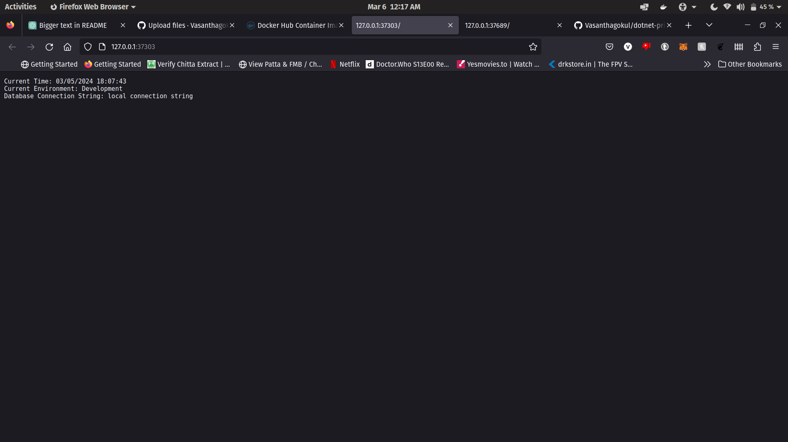
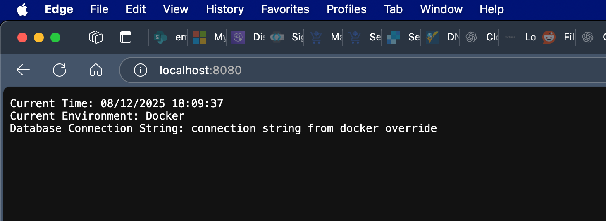
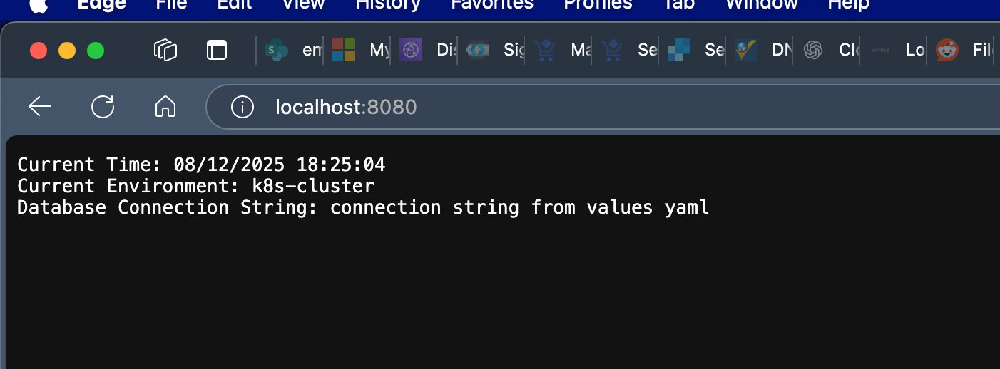

## Prerequisites for Ubuntu:

**Note: Use an Ubuntu VM for the following setup.**

### Install Docker:
```bash
sudo apt update
sudo apt install -y docker.io
sudo systemctl start docker
sudo systemctl enable docker
sudo usermod -aG docker $USER
newgrp docker
```

### Install kubectl:
```bash
curl -LO "https://dl.k8s.io/release/$(curl -L -s https://dl.k8s.io/release/stable.txt)/bin/linux/amd64/kubectl"
sudo install -o root -g root -m 0755 kubectl /usr/local/bin/kubectl
```

### Install minikube:
```bash
curl -LO https://storage.googleapis.com/minikube/releases/latest/minikube-linux-amd64
sudo install minikube-linux-amd64 /usr/local/bin/minikube
```

### Install Helm:
```bash
curl https://baltocdn.com/helm/signing.asc | gpg --dearmor | sudo tee /usr/share/keyrings/helm.gpg > /dev/null
echo "deb [arch=$(dpkg --print-architecture) signed-by=/usr/share/keyrings/helm.gpg] https://baltocdn.com/helm/stable/debian/ all main" | sudo tee /etc/apt/sources.list.d/helm-stable-debian.list
sudo apt update
sudo apt install helm
```

## To build the docker image:
```bash
docker build -t dotnet-print-appsettings .
```

## To run this image as a container:
```bash
docker run -d -p 8080:80 --name dotnet-print-appsettings-container dotnet-print-appsettings
```

<br>


visit localhost:8080 and you will see a page where three things are printed<br>

current time:<br>

environment: this is fetched from appsettings.json<br>
connection string: this is fetched from appsettings.json<br>




## To run with Docker environment variable overrides:
```bash
docker run -d -p 8080:80 \
  -e Environment="Docker" \
  -e Database__ConnectionString="connection string from docker override" \
  --name dotnet-print-appsettings-container \
  dotnet-print-appsettings
```



## Cluster Deployment:

### Start minikube:
```bash
minikube start
```

### Install with Helm:
```bash
helm upgrade --install dotnet-print-appsettings ./helm-chart
```

### Port forward to access the service:
```bash
kubectl port-forward service/dotnet-print-appsettings-helm-chart 8080:80
```

**Note:** If the port-forward connection drops during helm operations or pod restarts, rerun the port-forward command above.

### The values in the appsettings.json are overriden by the values present in the helm chart


## Using Different Values Files:

You can override values using different values.yaml files for different environments:

```bash
helm upgrade --install dotnet-print-appsettings ./helm-chart -f ./helm-chart/values-prod.yaml
```

```bash
helm upgrade --install dotnet-print-appsettings ./helm-chart -f ./helm-chart/values-staging.yaml
```

**Note:** If the application doesn't reflect the new values immediately, restart the deployment:
```bash
kubectl rollout restart deployment/dotnet-print-appsettings-helm-chart
```


## Centralized Helm Charts:

In production environments, it's common to use centralized Helm chart repositories. This allows teams to:
- Share common chart templates across multiple applications
- Maintain consistent deployment patterns
- Version control chart changes independently from application code
- Use tools like Helm repositories, ChartMuseum, or OCI registries for chart distribution


